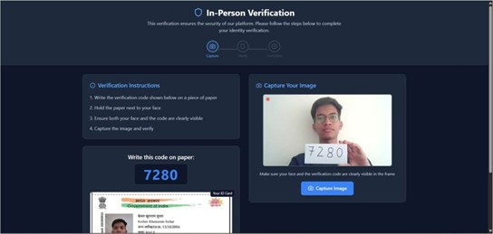
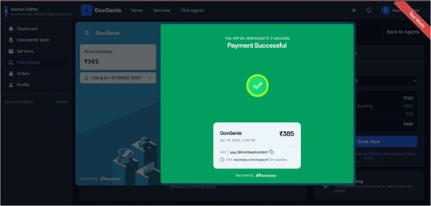

# GovGenie 🚀
### AI-Powered Civic Records Hub

> A secure AI-powered platform that simplifies government document services through verified agents, real-time communication, and intelligent automation.

---

## 📖 Overview

GovGenie is a full-stack MERN application designed to modernize and simplify government document procurement services such as:

- PAN Card Services
- Aadhaar Related Services
- Tax Filing
- Certificates & Documentation
- Government Verification Services

Traditional government processes are often slow, confusing, and vulnerable to fraud. GovGenie solves these challenges by providing a secure digital platform where users can connect with verified agents, upload documents securely, communicate in real-time, and track their service progress transparently.

The platform combines AI-powered assistance, facial verification, OCR-based authentication, secure payments, and real-time support to create a seamless and trustworthy user experience.

---

# ✨ Features

## 👤 User Features

- 🔐 Secure Login with OTP Authentication
- 📂 Secure Document Vault
- 📍 Nearby Verified Agent Finder
- 💬 Real-Time Chat System
- 🎥 Video Calling Support
- 🤖 AI Chatbot Assistance
- 📊 Live Service Tracking
- 💳 Razorpay Payment Integration
- 📁 Secure File Sharing

---

## 🧑‍💼 Agent Features

- ✅ Multi-Step Agent Verification
- 📋 Order Management Dashboard
- 💬 Real-Time User Communication
- 💰 Earnings & Transaction Tracking
- ⭐ Review & Rating System
- 🔒 VPN/IP-Based Secure Login

---

## 🛡️ Security Features

- JWT Authentication
- Two-Factor Authentication (2FA)
- OTP Verification
- Face Recognition Verification
- OCR-Based Validation
- End-to-End Encryption
- Role-Based Access Control (RBAC)
- Secure Cloud Storage

---

# 🛠️ Tech Stack

## Frontend
- React.js
- Vite
- Tailwind CSS
- Shadcn/UI

## Backend
- Node.js
- Express.js
- MongoDB Atlas
- Mongoose

## Real-Time Communication
- Socket.io
- ZegoCloud

## AI & Verification
- OpenCV
- EasyOCR
- Gemini API / NLP

## Cloud & Payments
- Cloudinary
- Razorpay

---

# 📌 Core Modules

| Module | Description |
|---|---|
| 🤖 Genie AI | AI chatbot for guidance and FAQs |
| 📂 Document Vault | Secure cloud-based document storage |
| 📍 Nearby Agent Finder | Uses Haversine Algorithm to locate nearby agents |
| 🎥 Video Calling | Real-time communication using ZegoCloud |
| 💬 Live Chat | Instant messaging between users & agents |
| 🔐 IPV Verification | Face + OTP based agent verification |
| 💳 Payment Gateway | Secure online payments using Razorpay |

---

# 📸 Project Highlights

✅ AI-powered government service assistance  
✅ Real-time communication system  
✅ Secure document management  
✅ Face verification with OCR  
✅ Scalable MERN architecture  
✅ Transparent service tracking  
✅ Fraud prevention mechanisms  

---

# 🖼️ Application Screenshots

## 👤 User Dashboard


---

## 🧑‍💼 Agent Dashboard


---

## 📂 Secure Document Vault


---

## 📍 Nearby Agent Finder


---

## 💬 Live Chat System


---

## 🎥 Video Calling Feature


---

## 🔐 Email Verification


---

## 🛡️ IPV Verification


---

## 💳 Razorpay Payment Integration


---

## 📋 Order Management Layout


---

# 📊 Performance & Validation

| Feature | Result |
|---|---|
| User Onboarding Completion | 96% under 3 minutes |
| IPV Verification Success Rate | 98.11% |
| Document Upload Success | 100% |
| PDF Upload Speed | 1.1 sec |
| Image Upload Speed | 0.9 sec |

---

# 🚀 Installation Guide

## 1️⃣ Clone Repository

```bash
git clone https://github.com/your-username/govgenie.git
cd govgenie
```

---

## 2️⃣ Install Dependencies

### Frontend

```bash
cd client
npm install
```

### Backend

```bash
cd server
npm install
```

---

# ⚙️ Environment Variables

Create a `.env` file inside the backend directory.

```env
PORT=5000

MONGO_URI=your_mongodb_uri

JWT_SECRET=your_jwt_secret

CLOUDINARY_CLOUD_NAME=your_cloud_name
CLOUDINARY_API_KEY=your_api_key
CLOUDINARY_API_SECRET=your_api_secret

RAZORPAY_KEY_ID=your_key
RAZORPAY_SECRET=your_secret

ZEGO_APP_ID=your_app_id
ZEGO_SERVER_SECRET=your_secret
```

---

# ▶️ Running the Project

## Start Backend

```bash
npm run server
```

## Start Frontend

```bash
npm run dev
```

# 🔮 Future Enhancements

- 🌐 Multi-Language Support
- 📱 Mobile Application
- ⛓️ Blockchain-Based Document Security
- 🧠 AI Fraud Detection
- 🏛️ Government Portal Integration
- 📊 AI-Based Agent Monitoring

---

# 📄 License

This project is developed for educational and academic purposes.

---
